# Git

## Git vs GitHub

At a high level, GitHub is a website and cloud-based service that helps developers store and manage their code, as well as track and control changes to their code.
To understand exactly what GitHub is, you need to know two connected principles:


- Version control
- Git


### What is version control?

Version control helps developers track and manage changes to a software project’s code. 
As a software project grows, version control becomes essential. 
Take WordPress…

At this point, WordPress is a pretty big project. 
If a core developer wanted to work on one specific part of the WordPress codebase, it wouldn’t be safe or efficient to have them directly edit the “official” source code.

Instead, version control lets developers safely work through branching and merging.

With branching, a developer duplicates part of the source code (called the repository). 
The developer can then safely make changes to that part of the code without affecting the rest of the project.

Then, once the developer gets his or her part of the code working properly, he or she can merge that code back into the main source code to make it official.

All of these changes are then tracked and can be reverted if need be.

### What Is Git?

Git is a specific open-source version control system created by Linus Torvalds in 2005.

Specifically, Git is a distributed version control system, which means that the entire codebase and history are available on every developer’s computer, which allows for easy branching and merging.

### What Is GitHub?

GitHub is a for-profit company that offers a cloud-based Git repository hosting service. Essentially, it makes it a lot easier for individuals and teams to use Git for version control and collaboration.

GitHub’s interface is user-friendly enough so even novice coders can take advantage of Git. Without GitHub, using Git generally requires a bit more technical savvy and use of the command line.

GitHub is so user-friendly, though, that some people even use GitHub to manage other types of projects – like writing books.

Additionally, anyone can sign up and host a public code repository for free, which makes GitHub especially popular with open-source projects.

As a company, GitHub makes money by selling hosted private code repositories, as well as other business-focused plans that make it easier for organizations to manage team members and security. 

### Exploring The GitHub Interface

To give you a basic understanding of what the GitHub interface looks like, here’s the [WordPress source code hosted at a GitHub repository](https://github.com/WordPress/WordPress).

From here, you can view the various branches that are being worked on, as well as when someone made a commit (this is kind of like “saving” a file).
Depending on how a repository is set up, you also might be able to create your own branch and make your own commits there.

And once you made some changes, you could submit that code back to a branch by making a pull request.
A pull request is basically asking the person in charge of the branch to include your code.
And it also helps that person see exactly what you’ve changed in the code.

If you wanted to edit some or all of the WordPress source code on your own account on a more permanent basis, you could also fork it by clicking the Fork button (a fork is similar in concept to a branch, but a fork is copying the repository into your account).

WordPress itself was originally a fork of b2/cafelog. If you want a bit more information on how you can use GitHub, [GitHub’s Hello World guide](https://docs.github.com/en/get-started/quickstart/hello-world) offers a beginner-friendly tutorial for getting started.

## Git tools

- [Git Fork](https://git-fork.com/): Visual git client.
- [GitHub CLI](https://cli.github.com/): Do Github operations easily from the CLI.

## More resources

- [Visual Git Reference](https://marklodato.github.io/visual-git-guide/index-en.html)
- Play with git operations and visualize what is happening internally: [Visualizing git](http://git-school.github.io/visualizing-git)
- [Hello world with git on Github](https://docs.github.com/en/get-started/quickstart/hello-world).
## Visualize Git

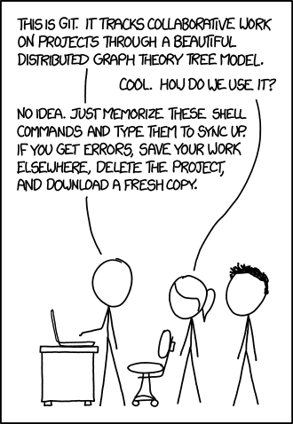

Git can be complicated, but that does not mean necessarily it can not be understood unless you are a git expert. 
You all probably have used git at some point in your development stages and you are familiar with the basics.

### Our starting point

Below representation will be our visual workspace.

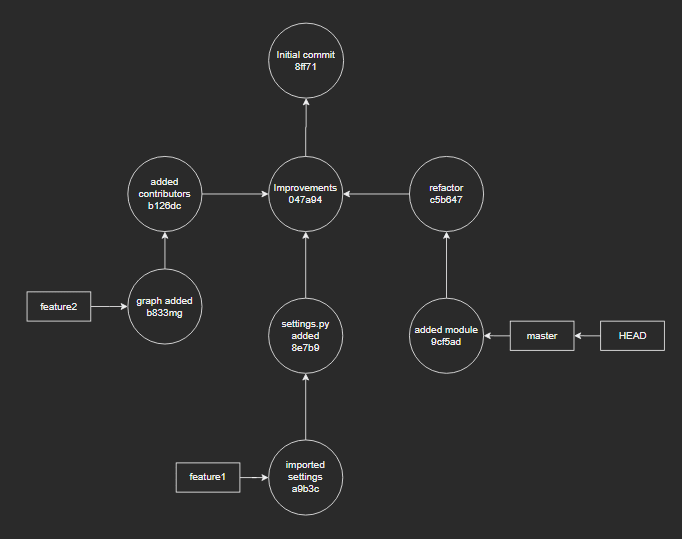

This is our repository and it has several commits and branches in it.
First, we have an initial commit (the root of our tree) at the top, after which we have 3 commits (**added contributors**, **improvements**, and **refactor**), whose parents are the same. 
As you see, we also have 3 branches, **master**, **feature1**, and **feature2**. We also have **HEAD** which we will talk about in a bit.

###  What is HEAD and HEAD~? 

We will move HEAD from time to time in our visual graph. 
HEAD is nothing more than a pointer in your git workflow, it just marks where you are. 
Now in order to mark other locations, we might need a reference point.
That is for instance, if I need to explain to someone where the commit refactor is, I can just say go 2 commits above HEAD and there you will find it. 
Thus HEAD~1 is like saying "the commit above HEAD" and similarly HEAD~2 is equal to saying "the commit 2 steps above HEAD". 
By the way HEAD~ is the same as HEAD~1.

In order to prove our point let us execute git checkout feature2:

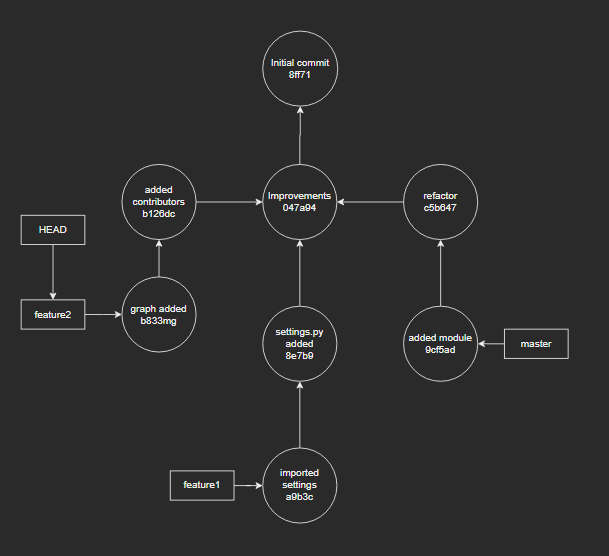


### What is `--soft` and `--hard`

- `git reset --soft HEAD~` - move back one commit and keep your changes
- `git reset --hard HEAD~` - move back one commit and discard all changes

### Modify a commit

You might sometimes commit a work-in-progress and immediately realize you forgot to add something to the commit.

- `git add` - add the missing/modified file(s) you forgot to add
-  `git commit --amend --no-edit` - alter the previous commit (remove `--no-edit` if you want to modify the commit message)


This will replace your commit with a fresh new one. 
Now let's see what changed in our visual graph. 
The only modification was to the hash of our commit. That means we changed the contents of this commit.

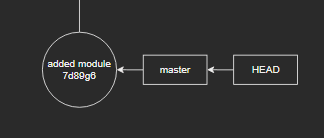

### Commited to master instead of a new branch?

We were working casually and finished our work, only to commit to master instead of another branch. Ah, a silly mistake indeed. You can see our mistake in the graph below.

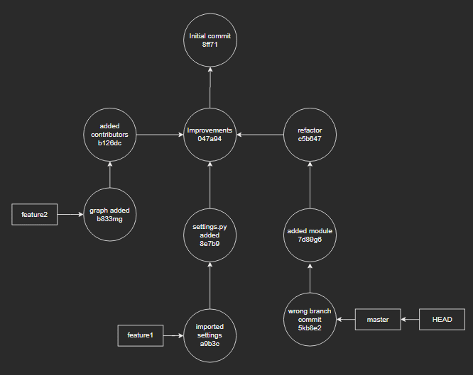

- `git branch feature3` - create a new branch at your current position
- `git reset HEAD~ --hard` - take back master to the previous commit
- `git checkout feature3` - switch to your new branch

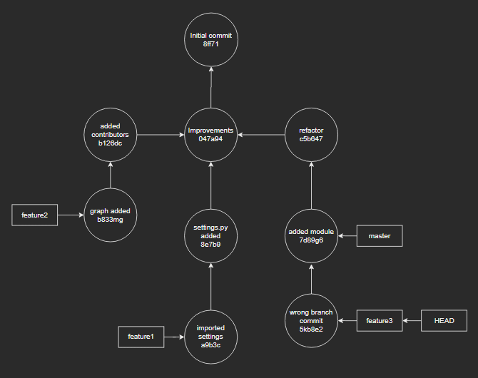

Okay seems like we now have a branch called feature3 and we successfully recovered our master to where it belongs. HEAD is pointing to the feature3 branch and that's what we expect from the last action we took above.

### Committed to the wrong branch

This is a very common scenario and it has an easy fix, unless you have pushed your changes. 

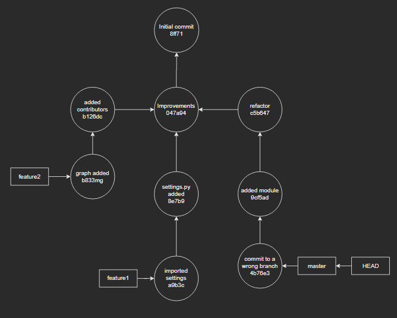
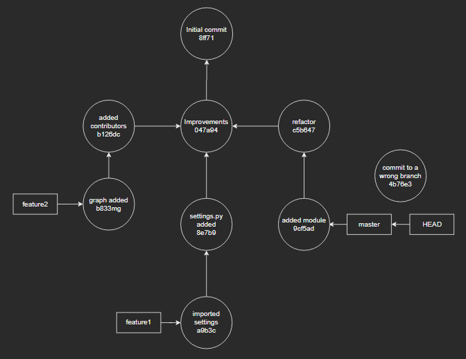


- `git checkout feature2` - switch to another branch
- `git stash pop` - unpack your changes from stash

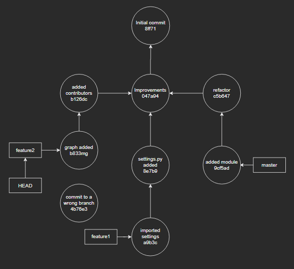

 - `git add .` - add your files and commit them normally
 - `git commit -m "fixed"`

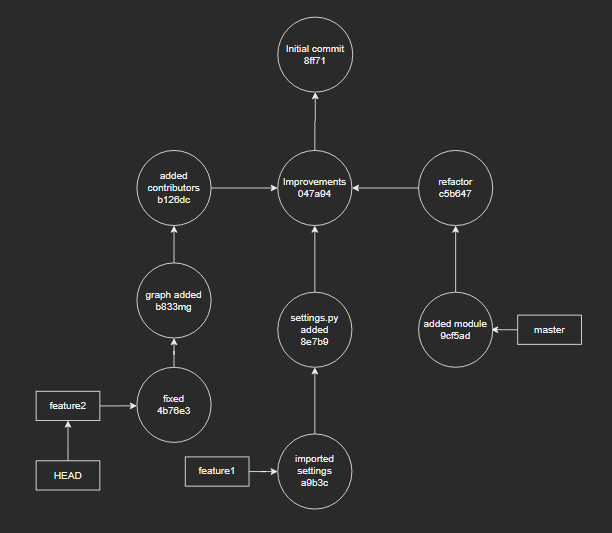


### I want to revert this specific commit from 10 days before 

- `git log` - find the hash of that commit you want to revert
- `git revert <hash>`

This action creates a revert commit, meaning it does NOT modify any of your previous commits and just creates a new commit with the exact opposite file modifications.
You can see the reverse commit below, a whole new commit.

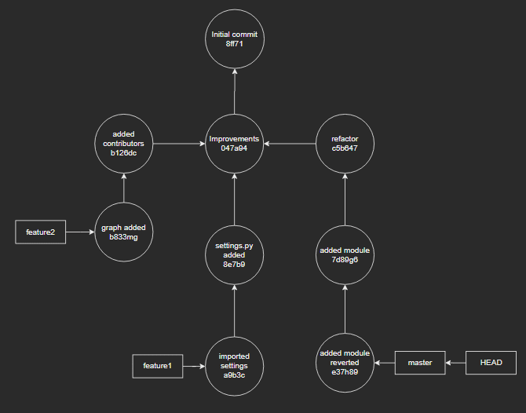


### I lost my commit!

It is best we visualize this one to understand what's coming step by step.

Imagine checking out a specific commit, in this case refactor.

```shell
$ git checkout c5b64
Note: checking out 'c5b647'.

You are in 'detached HEAD' state...
```

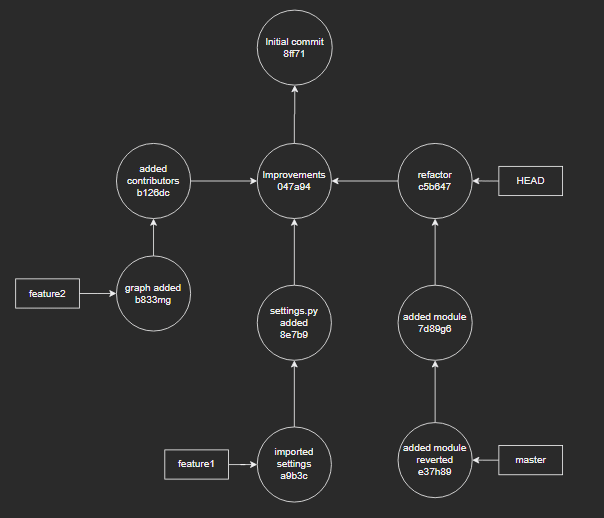

What does that even mean? 
Pretty much nothing is unrecoverable in git except that previously mentioned hard reset or maybe deleting your folder altogether.
A detached HEAD state means you are pointing to a commit directly, instead of pointing to a branch.

Since we are pointing to a lonely commit, let us change something and commit it and see what happens.

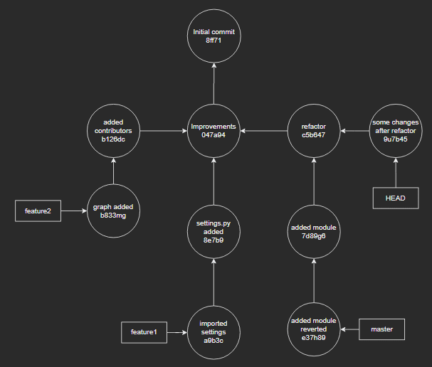

Seems like we are still in that detached HEAD state. 
Let's assume we took such an action while not knowing the bits and pieces of git and switched back to master via git checkout master. 
Clearly we now know, git checkout master in its most basic form is like saying "Go ahead and just point to master".

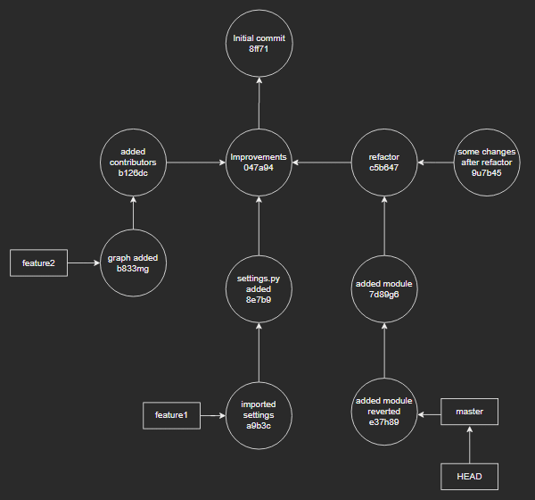

We checked out some unknown commit somewhere, made some changes and committed it with the name of "some changes after refactor" and moved back to master.
Now, since you don't know the hash of that "some changes after refactor" commit and it does not have an explicit branch attached to it, you have no way of knowing if it's there.
Hence, you think after all your developments and improvements, you lost it all and it's time to start from ground zero. 
Stop right there because git reflog is coming for rescue.

We may inspect the output of this command:

```bash
$ git reflog
5b35f6d HEAD@{1}: pull ...
ca92d15 HEAD@{2}: ...
759dab1 HEAD@{3}: commit (merge): ...
065e269 HEAD@{4}: commit: ...
f357606 HEAD@{5}: commit: ...
9u7b45 HEAD@{6}: checkout: moving from master to 9u7b45d272867b63d54f96d4aa57f8ecc479cd0
```

That `9u7b45 HEAD@{6}: checkout: moving from master to 9u7b45d272867b63d54f96d4aa57f8ecc479cd0` should give you a pretty rough idea of what you have done, that is, you have moved to a branchless commit in the past.
There it is now, your commit that was drifting in space without any label on it. Now go there and put a label on it, or that is to say, create a branch, whatever.

